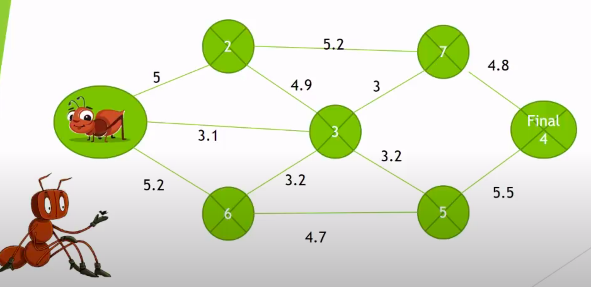

# ant-colony

## 1. Cree el venv y actívelo

```
python -m venv venv
source venv/bin/activate
```
## 2. Instale los requerimientos

```
pip install -r requirements.txt
```

## 3. Cree el archivo example.path

Este archivo representa el camino que recorrerá las hormigas. En example.path.in hay un ejemplo.<br/>
En Linux es así:
```
cp example.path.in path.in
```
## 4. Cree las variables de entorno
En estas variables de entorno está la información del proceso a ejecutar<br/>
En Linux es así
```
cp .env.example .env
```
## 5. Corra el proyecto
```
python main.py
```
## Formato del archivo path.in

### Estructura

n gph e<br/>
x lineas con:<br/>
n1 n2 w (ph: opcional)

### Primera línea

Tiene 3 elementos requeridos separados por espacios: Número de nodos (n), el número de feromonas que va a existir al
iniciar el proceso en cada conexión entre los nodos (gph) y la evaporación de las feromonas (e)

### Resto del archivo

Por cada línea existirá separado por espacios: nodo 1, nodo 2 y el peso entre esos nodos, representando que entre nodo 1
y nodo 2 existe el peso especificado en la línea. Además opcionalmente tiene un valor de las feromonas que van a existir
en esa conexión (ph)

## Ejemplo

Este es el ejemplo que se encuentra actualmente en example.path.in